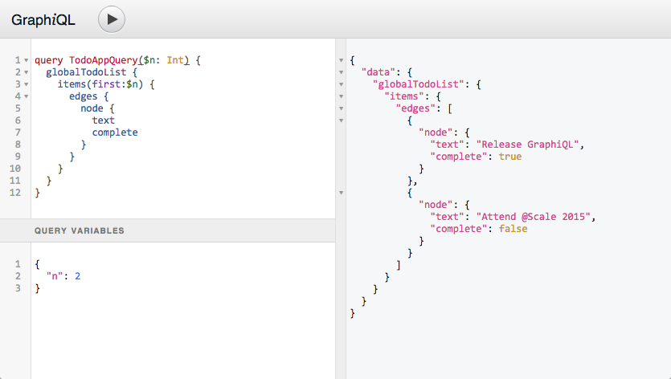

# Single End Point

A major difference between REST and GraphQL is the endpoint. Think of the endpoint as the path of the URL.

```text
https://www.gitbook.io/graphql/single-end-point
```

Up above, the end point would be the final path called 'single-end-point'. For REST, this could branch out to have multiple end points, all with different path. However, in GraphQL, there is only one end point!

## Benefits

Having a single end point means that the all request are passing through one point. Here is a glimpse of the difference between REST and GraphQL

### Efficient Data Fetching


REST has prepares each of their endpoints to have a set/prepared/fixed return payload. This means that there will be cases where fetching data for a client will be more than necessary. Likewise, if there are any changes in the client and they require more data types, restructuring is necessary.

This issue is recognized as Overfetching and Underfetching.


However, this is not the case for GraphQL. With a single endpoint, all data are on 'standby'. To retrieve said data, one just needs to request through Query what they need - no more, no less.

### Flexible to Iterations on Client Side

A common pattern with REST APIs is to structure the endpoints according to the views that you have inside your app. 

Now, imagine that you will need to change a certain request on the front-end. 

* **If the structure of this request is left unchanged**, it will face an issue of Overfetching or Underfetching. 
* **If the structure of this request was changed**,, you would most likely have to go into the server side to modify the request call. 

However, with GraphQL, you can change the request directly in the client side. \(Explained more in detail in **Actions**\)

### GraphiQL

GraphiQL is an interface to test your queries. Think of it as an inbuilt Insomnia or Postman but on the browser.



The greatest benefit of GraphiQL is the ability to test your Query and Mutation on the client side. This means that you do not need to go into the server and console.log out the values.

Better yet, the Query or Mutation that is being used in GraphiQL can be copy, pasted into your server and used. \(More information in **How to GraphiQL**\)  


### GraphQL Schema Definition Language \(SDL\)


